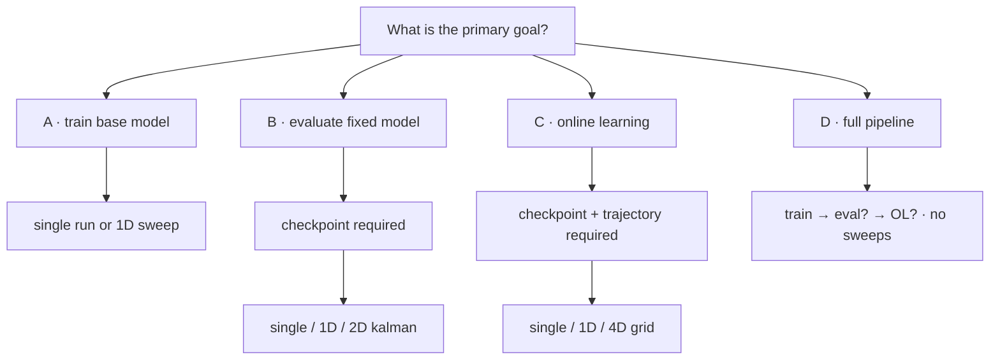

# SubspaceNet Online Learning

Direction-of-arrival (DOA) estimation with **SubspaceNet**, Extended Kalman Filter tracking, and **online learning** on non-stationary trajectories.

## Setup

```bash
pip install -r requirements.txt   # if present
export PYTHONPATH="${PYTHONPATH}:$(pwd):$(pwd)/DCD_MUSIC"
```

## CLI

Two entry points coexist during migration:

| Entry | Status | Use for |
|-------|--------|---------|
| `main_v2.py` | **Recommended** | New runs; unified `run` command |
| `main.py` | Legacy | Existing launch.json / scripts until cutover |

### Quick start (v2)

```bash
# Help
python3 main_v2.py --help
python3 main_v2.py run --help

# Train a base model
python3 main_v2.py run -c configs/default_config.yaml --goal train

# Evaluate a checkpoint
python3 main_v2.py run -c configs/evaluation_configs/default_eval_config.yaml \
  --goal evaluate -m path/to/checkpoint.pt

# Online learning (trajectory required)
python3 main_v2.py run \
  -c configs/Used_for_paper/SineAccel_base_model_Online_learning_eta_sweep_config.yaml \
  --goal online_learning --trajectory --sweep 1d --axis eta --lr-sweep
```

### Decision tree

**Interactive (YAML + commands on every leaf):** open [`docs/decision_tree.html`](docs/decision_tree.html) in a browser after cloning, or browse it on GitHub.



#### Terminal recipes (main_v2.py)

| Branch | Leaf | YAML | Command |
|--------|------|------|---------|
| A | single train | `configs/Used_for_paper/Random_basemodel_training_config.yaml` | `python3 main_v2.py run -c configs/Used_for_paper/Random_basemodel_training_config.yaml --goal train` |
| A | SNR train sweep | `configs/training_config/Random_basemodel_training_config.yaml` | `... --goal train --sweep 1d --axis snr -v -10 -v 0 -v 10` |
| B | single eval | `configs/evaluation_configs/default_eval_config.yaml` | `... --goal evaluate -m path/to/checkpoint.pt` |
| B | SNR eval sweep | `configs/evaluation_configs/snr_sweep_config.yaml` | `... --goal evaluate -m MODEL --sweep 1d --axis snr` |
| B | kalman 2D | `configs/evaluation_configs/default_eval_config.yaml` | `... --goal evaluate -m MODEL --sweep 2d_kalman` |
| C | single OL | `configs/online_learning_config.yaml` | `... --goal online_learning --trajectory -m MODEL` |
| C | eta + LR sweep | `configs/Used_for_paper/SineAccel_base_model_Online_learning_eta_sweep_config.yaml` | `... --goal online_learning --trajectory --sweep 1d --axis eta --lr-sweep` |
| C | 4D grid | `configs/online_learning_config.yaml` | `... --goal online_learning --trajectory --sweep 4d_grid -m MODEL` |
| D | full pipeline | `configs/default_config.yaml` | `python3 main_v2.py run -c configs/default_config.yaml --goal full` |

Sweep types: `--sweep none|1d|2d_kalman|4d_grid` with `--axis` / `-v` for 1D. Other axes reuse the same pattern — swap `--axis` and `-v` (see decision tree HTML for full paths and invalid combos).

**Full CLI reference:** [docs/CLI.md](docs/CLI.md)  
**Interactive decision tree:** [docs/decision_tree.html](docs/decision_tree.html)  
**Routing logic:** [docs/cli_routing_spec.md](docs/cli_routing_spec.md)  
**Legacy command map:** [docs/cli_flow_diagram.md](docs/cli_flow_diagram.md)  
**Backlog / planned work:** [docs/TBD.md](docs/TBD.md)

### Common flags

| Flag | Purpose |
|------|---------|
| `-c` / `--config` | YAML config path |
| `-o` / `--output` | Results directory |
| `-O` / `--override` | Dot-path override (`training.epochs=10`) |
| `--goal` | `train`, `evaluate`, `online_learning`, `full` |
| `-m` / `--model` | Checkpoint path (evaluate / OL) |
| `--trajectory` | Enable trajectory data generation |
| `--sweep` / `--axis` / `-v` | Parameter sweep |
| `--lr-sweep` | Nested LR sweep (OL + eta axis only) |

## Tests

```bash
python3 -m pytest tests/test_integration.py tests/test_cli_*.py -v
python3 -m pytest tests/test_cli_paper_parity.py -v   # slow: paper config numeric parity
```

## Project layout

```
main_v2.py          CLI v2 entry point
main.py             Legacy CLI
cli/                v2 routing (resolver, validation, runner, sweeps)
simulation/         Simulation pipeline (training, eval, online learning)
configs/            Experiment YAMLs (see configs/Used_for_paper/ for paper runs)
docs/CLI.md              CLI user guide
docs/decision_tree.html  Interactive routing tree (YAML + commands)
tests/              Integration + CLI tests
```

## Further reading

- [ONLINE_LEARNING_DOCUMENTATION.md](docs/ONLINE_LEARNING_DOCUMENTATION.md)
- [GLRT_DRIFT_DETECTION_AND_ADAPTIVE_LEARNING.md](docs/GLRT_DRIFT_DETECTION_AND_ADAPTIVE_LEARNING.md)
